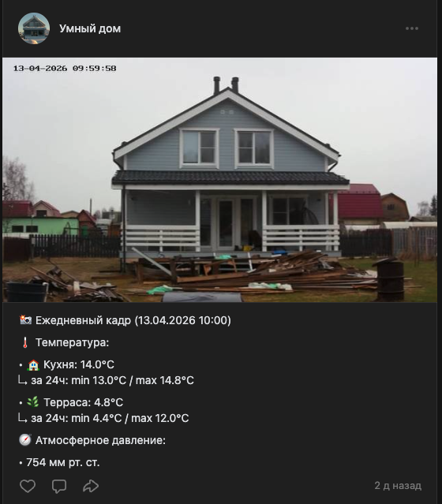
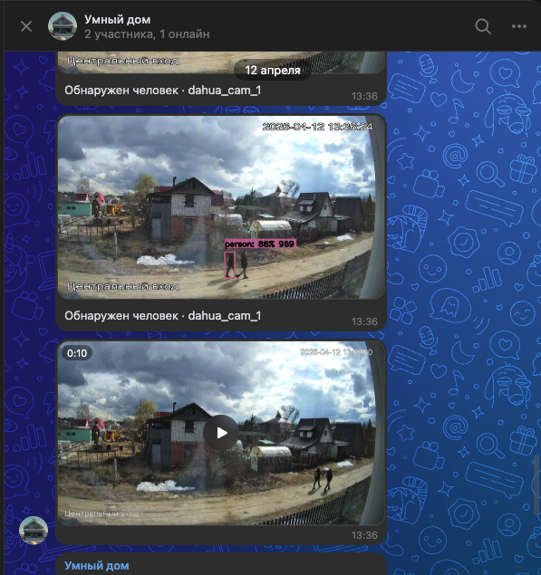

# ha-vk

[Русский](README.md) | [English](README.en.md)

[](https://github.com/vint52/ha-vk)
[](https://github.com/vint52/ha-vk?tab=readme-ov-file#installation)
[](https://github.com/vint52/ha-vk/blob/main/pyproject.toml)
[](https://github.com/vint52/ha-vk/actions/workflows/validate.yml)
[](LICENSE)


[](https://my.home-assistant.io/redirect/hacs_repository/?owner=vint52&repository=ha-vk&category=integration)

VK Client for Home Assistant.

HACS-installable custom integration for sending VK messages, images, videos, and wall posts directly from Home Assistant.

This integration is based on the behavior of the earlier [`vint52/homeassistent_vk_proxy`](https://github.com/vint52/homeassistent_vk_proxy) project and keeps the same functional parity:

- text messages via `notify`
- text messages with optional image or video attachments via `ha_vk.send_message`
- wall posts via `ha_vk.send_post`
- incoming community messages as Home Assistant events via `ha_vk_incoming_message`

## Installation

### HACS

`ha-vk` is available as a custom HACS repository.

[](https://my.home-assistant.io/redirect/hacs_repository/?owner=vint52&repository=ha-vk&category=integration)

Use the button above to open this repository directly in HACS.

_or_

1. Add this repository to HACS as a custom repository of type `Integration`.
2. Install `ha-vk`.
3. Restart Home Assistant.
4. Go to `Settings -> Devices & services -> Add integration`.
5. Search for `VK Client for Home Assistant`.

## Configuration

The setup flow asks for:

- `Notify entity name`: used as the Home Assistant notify entity name
- `VK access token`: community token used for messages and uploads
- `VK peer ID`: user ID or chat peer ID
- `VK group ID`: required for wall posts and incoming community messages
- `Enable incoming VK messages`: turns on VK long poll and Home Assistant events for new messages from the configured peer
- `VK wall access token`: optional user token for photos/videos on the community wall and for uploading videos on behalf of a user
- `VK API version`: defaults to `5.131`
- `Request timeout`: defaults to `30`

Detailed instructions for obtaining all required VK tokens and IDs are available in [`TOKENS.en.md`](TOKENS.en.md).
Ready-to-use automation snippets and usage ideas are collected in [`docs/examples.en.md`](docs/examples.en.md).

After setup, Home Assistant creates a notify entity named from your chosen title.
Example: if the title is `ha-vk`, you will get a notify entity such as `notify.ha_vk`.
You can later change this title in the integration options to rename the generated notify entity.

## Usage

### Messages and attachments

```yaml
action: ha_vk.send_message
data:
  message: "Door opened"
  title: "Home Assistant"
```

Or via the Home Assistant notify entity action:

```yaml
action: notify.send_message
data:
  entity_id: notify.ha_vk
  message: "Door opened"
  title: "Home Assistant"
```

`title` is optional. If present, it is prepended to the message body.

Send an image in the same service call:

```yaml
action: ha_vk.send_message
data:
  message: "Camera snapshot"
  image: "http://frigate.local/api/events/123/snapshot.jpg?bbox=1&crop=0"
```

Send a video in the same service call:

```yaml
action: ha_vk.send_message
data:
  message: "Motion clip"
  video: "http://frigate.local/api/events/123/clip.mp4"
  type: "video"
```

Use `type: document` to force document upload when VK video upload is not desired. Pass only one of `image` or `video` in a single `ha_vk.send_message` call.

### Incoming messages

When `Enable incoming VK messages` is turned on, `VK group ID` is configured, and the community token has access to community messages, `ha-vk` starts a VK long poll receiver and fires a Home Assistant event for each new incoming message from the configured `VK peer ID`.

Event type:

```text
ha_vk_incoming_message
```

Event payload includes:

- `entry_id`
- `group_id`
- `peer_id`
- `from_id`
- `conversation_message_id`
- `message_id`
- `event_id`
- `date`
- `text`
- `attachments`
- `raw_event`

If the message text starts with `/`, an additional `ha_vk_command` event is
fired with `command`, `args` and `args_text` fields — see
[examples](docs/examples.en.md).

Example automation:

```yaml
automation:
  - alias: React to incoming VK message
    trigger:
      - platform: event
        event_type: ha_vk_incoming_message
    action:
      - action: logbook.log
        data:
          name: VK
          message: "{{ trigger.event.data.text }}"
```

### Wall post

```yaml
action: ha_vk.send_post
data:
  message: "Post with image"
  image: "http://frigate.local/api/events/123/snapshot.jpg?bbox=1&crop=0"
```

## Usage examples

### Photo and video in group messages

Example of photo and video delivery to VK group messages:



### Info and photo on the community wall

Example of a wall post with a photo and status information:



## Multiple VK accounts or chats

If you configure multiple ha-vk entries, service calls under `ha_vk.*` must include `entry_id`:

```yaml
action: ha_vk.send_post
data:
  entry_id: "01JABCDEF0123456789"
  message: "Post to a specific profile"
```

Each config entry also gets its own notify entity under the `notify` domain.

## VK setup notes

- `VK peer ID`: use a user ID for direct messages, or `2000000000 + chat_id` for group chats.
- Incoming messages are emitted only for the configured `VK peer ID`.
- `VK group ID`: required for incoming community messages because VK group long poll is bound to the community ID.
- `VK wall access token`: needed for photos/videos on the community wall and for uploading videos on behalf of a user. Without it, videos in messages can still be sent as documents, but photos and videos cannot be posted on the community wall.
- The integration downloads media URLs from Home Assistant, so the URLs must be reachable from your HA instance.

## Troubleshooting

- `Failed to download media file`: the media URL is unreachable from Home Assistant.
- `URL content type ... is not supported`: the remote server returned a non-image or non-video content type.
- If `ha_vk.send_post` publishes text without the image: configure a user token with `wall`, `photos`, `video`, and `offline` scopes in `VK wall access token`.
- `Incoming VK messages are unavailable for this community configuration`: verify that community messages are enabled in VK and that the community token can access long poll for the selected group.
- `VK wall access token is invalid`: generate a new user token. If you get it through `https://vkhost.github.io/` and see `{"error":"invalid_request","error_description":"application is blocked"}`, try another app from the service list, for example `VK Admin`, `VK Admin (iOS)`, `vk.com`, or `Kate Mobile`.
- `Multiple ha-vk entries are configured; pass entry_id explicitly`: add `entry_id` to the custom service call.

## Open Source

- License: [`LICENSE`](LICENSE)
- Contributing guide: [`CONTRIBUTING.md`](CONTRIBUTING.md)
- Code of Conduct: [`CODE_OF_CONDUCT.md`](CODE_OF_CONDUCT.md)
- Security policy: [`SECURITY.md`](SECURITY.md)
- Support guide: [`SUPPORT.md`](SUPPORT.md)
