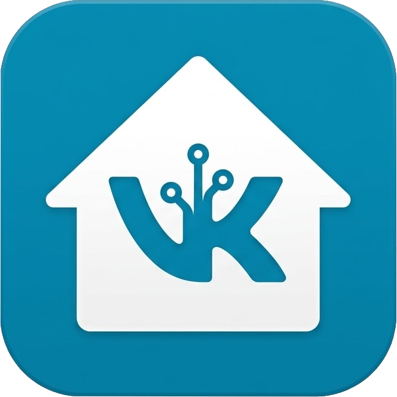

# ha-vk

[English](README.md) | [Русский](README.ru.md)

[](https://github.com/vint52/ha-vk)
[](https://github.com/vint52/ha-vk?tab=readme-ov-file#%D1%83%D1%81%D1%82%D0%B0%D0%BD%D0%BE%D0%B2%D0%BA%D0%B0)
[](https://github.com/vint52/ha-vk)
[](https://github.com/vint52/ha-vk/blob/main/pyproject.toml)



[](https://my.home-assistant.io/redirect/hacs_repository/?owner=vint52&repository=ha-vk&category=integration)

VK-клиент для Home Assistant.

Пользовательская интеграция с поддержкой установки через HACS для отправки сообщений VK, изображений, видео и постов на стену напрямую из Home Assistant без внешнего HTTP-прокси.

Интеграция основана на логике более раннего проекта [`vint52/homeassistent_vk_proxy`](https://github.com/vint52/homeassistent_vk_proxy) и сохраняет ту же функциональность:

- текстовые сообщения через `notify`
- изображения через `ha_vk.send_image`
- видео через `ha_vk.send_video`
- посты на стену через `ha_vk.send_post`

## Установка

### HACS

`ha-vk` доступен как пользовательский репозиторий HACS.

[](https://my.home-assistant.io/redirect/hacs_repository/?owner=vint52&repository=ha-vk&category=integration)

Используйте кнопку выше, чтобы открыть этот репозиторий напрямую в HACS.

_или_

1. Добавьте этот репозиторий в HACS как пользовательский репозиторий типа `Integration`.
2. Установите `ha-vk`.
3. Перезапустите Home Assistant.
4. Перейдите в `Settings -> Devices & services -> Add integration`.
5. Найдите `VK Client for Home Assistant`.

## Конфигурация

Во время настройки мастер запросит:

- `Notify entity name`: используется как имя notify-сущности в Home Assistant
- `VK access token`: токен сообщества для сообщений и загрузки файлов
- `VK peer ID`: ID пользователя или peer ID чата
- `VK group ID`: требуется для публикации постов на стену
- `VK wall access token`: необязательный пользовательский токен, необходимый для постов на стену с изображениями
- `VK API version`: по умолчанию `5.131`
- `Request timeout`: по умолчанию `30`

После завершения настройки Home Assistant создаст notify-сущность с именем на основе выбранного названия.
Пример: если указать `ha-vk`, будет создана notify-сущность вроде `notify.ha_vk`.
Позже это название можно изменить в параметрах интеграции, чтобы переименовать созданную notify-сущность.

## Использование

### Текстовые уведомления

```yaml
action: ha_vk.send_message
data:
  message: "Door opened"
  title: "Home Assistant"
```

Или через действие notify-сущности Home Assistant:

```yaml
action: notify.send_message
data:
  entity_id: notify.ha_vk
  message: "Door opened"
  title: "Home Assistant"
```

`title` необязателен. Если он указан, то добавляется перед основным текстом сообщения.

### Изображение

```yaml
action: ha_vk.send_image
data:
  image: "http://frigate.local/api/events/123/snapshot.jpg?bbox=1&crop=0"
```

### Видео

```yaml
action: ha_vk.send_video
data:
  video: "http://frigate.local/api/events/123/clip.mp4"
  type: "video"
```

Используйте `type: document`, если нужно принудительно загружать файл как документ, а не как VK-видео.

### Пост на стену

```yaml
action: ha_vk.send_post
data:
  message: "Пост с картинкой"
  image: "http://frigate.local/api/events/123/snapshot.jpg?bbox=1&crop=0"
```

## Несколько аккаунтов или чатов VK

Если настроено несколько записей `ha-vk`, в вызовах сервисов `ha_vk.*` нужно явно передавать `entry_id`:

```yaml
action: ha_vk.send_post
data:
  entry_id: "01JABCDEF0123456789"
  message: "Пост в конкретный профиль"
```

Каждая запись конфигурации также получает собственную notify-сущность в домене `notify`.

## Примечания по настройке VK

- `VK peer ID`: используйте ID пользователя для личных сообщений или `2000000000 + chat_id` для групповых чатов.
- `VK wall access token`: обязателен для `/send_post` с загрузкой изображений, потому что токены сообщества не могут загружать фото на стену.
- Интеграция скачивает медиа по URL из Home Assistant, поэтому эти URL должны быть доступны из экземпляра HA.

## Устранение неполадок

- `Failed to download media file`: URL медиафайла недоступен из Home Assistant.
- `URL content type ... is not supported`: удаленный сервер вернул тип содержимого, который не является изображением или видео.
- `VK wall access token is required for posts with images`: настройте пользовательский токен со scope `wall`, `photos` и `offline`.
- `Multiple ha-vk entries are configured; pass entry_id explicitly`: добавьте `entry_id` в вызов пользовательского сервиса.
